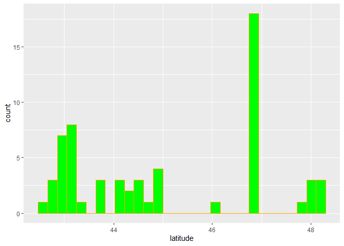
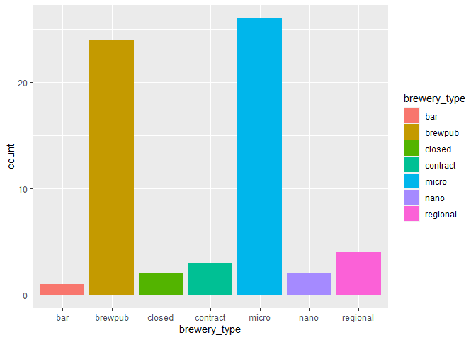
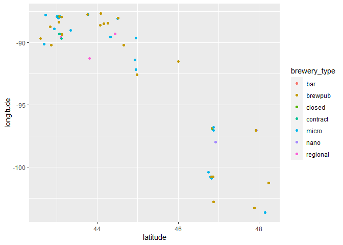
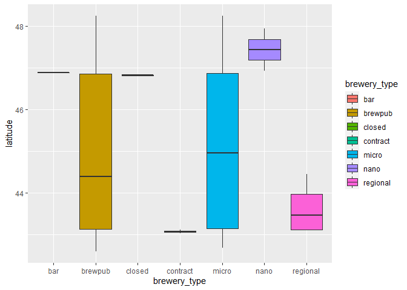
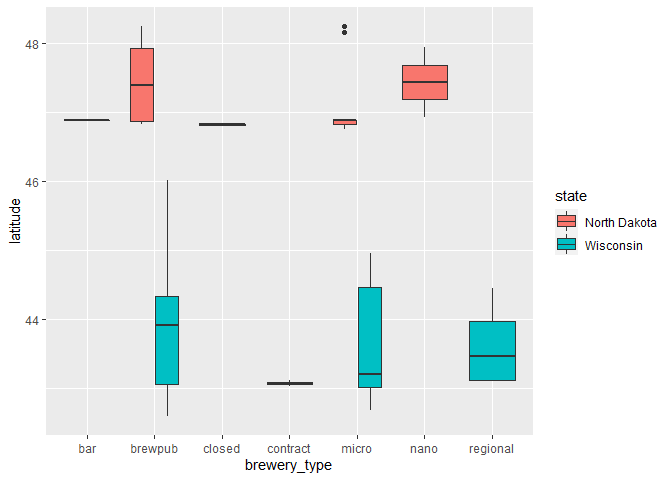
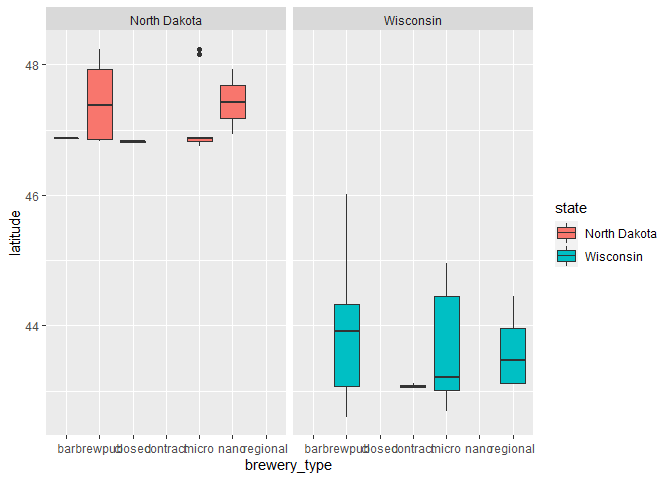

ST 558 Project 2
================
Matthew Sookoo and Rachel Hardy
2022-10-10

-   <a href="#introduction" id="toc-introduction">Introduction</a>
-   <a href="#required-packages" id="toc-required-packages">Required
    packages</a>
-   <a href="#writing-the-functions" id="toc-writing-the-functions">Writing
    the Functions</a>
    -   <a href="#function-number-one-listbreweries"
        id="toc-function-number-one-listbreweries">Function Number One:
        listBreweries()</a>
    -   <a href="#function-number-two-listbystate"
        id="toc-function-number-two-listbystate">Function Number Two:
        listByState()</a>
    -   <a href="#function-number-three-listbycity"
        id="toc-function-number-three-listbycity">Function Number Three:
        listByCity()</a>
    -   <a href="#function-number-four-listbydistance"
        id="toc-function-number-four-listbydistance">Function Number Four:
        listByDistance()</a>
    -   <a href="#function-number-five-listbytype"
        id="toc-function-number-five-listbytype">Function Number Five:
        listByType()</a>
    -   <a href="#function-number-six-listbysearch"
        id="toc-function-number-six-listbysearch">Function Number Six:
        listBySearch()</a>
-   <a href="#data-retreival-and-exploratory-analysis"
    id="toc-data-retreival-and-exploratory-analysis">Data Retreival and
    Exploratory Analysis</a>
    -   <a href="#data-retreival-examples" id="toc-data-retreival-examples">Data
        Retreival Examples</a>
        -   <a href="#brewpubs-and-bars-wisconsin-vs-north-dakota"
            id="toc-brewpubs-and-bars-wisconsin-vs-north-dakota">Brewpubs and Bars:
            Wisconsin vs North Dakota</a>
        -   <a href="#distance-from-madison-wisconsin"
            id="toc-distance-from-madison-wisconsin">DIstance from Madison,
            Wisconsin</a>
    -   <a href="#contingency-tables" id="toc-contingency-tables">Contingency
        Tables</a>
    -   <a href="#plots" id="toc-plots">Plots</a>
        -   <a href="#histogram" id="toc-histogram">Histogram</a>
        -   <a href="#bar-plot" id="toc-bar-plot">Bar Plot</a>
        -   <a href="#scatter-plot" id="toc-scatter-plot">Scatter Plot</a>
        -   <a href="#box-plot" id="toc-box-plot">Box Plot</a>

# Introduction

Our goal with this project is to create a vignette about contacting an
API using functions we’ve created to query, parse, and return
well-structured data. We’ll then use our functions to obtain data from
the API and do some exploratory data analysis!

# Required packages

To use the functions for interacting with the API, the following
packages are used:

-   `tidyverse`: Tons of useful features for data manipulation and
    visualization!
-   `jsonlite`: Used for API interaction.
-   `httr`: Used to make http requests in R language as it provides a
    wrapper for the curl package.
-   `knitr`: Used for displaying tables in a markdown-friendly way.

# Writing the Functions

In this section we will write the functions for data retrieval. These
functions will allow the user to customize their query to return
specific data. We will be using an API that is focused on breweries.
Each function will return a data frame with variables such as brewery
ID, name, type, address (street, city, and state variables), postal
code, country, longitude, latitude, phone number, and website URL to
name a few. Each function will have a brief description.

## Function Number One: listBreweries()

The first function is a function that will return a list of breweries of
user-specified length. Default length is 20 and maximum length is 50.

``` r
listBreweries <- function(length = 20) {
  
  #Create the full URL that will be used to retrieve the data.
  baseURL <- "https://api.openbrewerydb.org/"
  endpoint <- "breweries?per_page="
  fullURL = paste0(baseURL, endpoint, length)
  
  #Get the API output.
  outputAPI <- GET(fullURL)
  
  #Parse the API output to get a data frame.
  finalAPI <- fromJSON(rawToChar(outputAPI$content))
  
  #Return the final data frame.
  return(as_tibble(finalAPI))
}
```

## Function Number Two: listByState()

The second function is a function that will return a list of breweries
of user-specified length and state. Default length is 20 and default
state is North Carolina.

``` r
listByState <- function(state = "North Carolina", length = 20) {
  
  #Make sure state is all lowercase with underscores instead of spaces.
  state <- tolower(state)
  state <- sub(" ", "_", state)
  
  #Create the full URL that will be used to retrieve the data.
  baseURL <- "https://api.openbrewerydb.org/"
  endpoint1 <- "breweries?by_state="
  endpoint2 <- "&per_page="
  fullURL = paste0(baseURL, endpoint1, state, endpoint2, length)
  
  #Get the API output.
  outputAPI <- GET(fullURL)
  
  #Parse the API output to get a data frame.
  finalAPI <- fromJSON(rawToChar(outputAPI$content))
  
  #Return the final data frame.
  return(as_tibble(finalAPI))
}
```

## Function Number Three: listByCity()

The third function is a function that will return a list of breweries of
user-specified length and city. Default length is 20 and default city is
San Diego, California.

``` r
listByCity <- function(city = "San Diego", length = 20) {
  
  #Make sure city is all lowercase with underscores instead of spaces.
  city <- tolower(city)
  city <- sub(" ", "_", city)
  
  #Create the full URL that will be used to retrieve the data.
  baseURL <- "https://api.openbrewerydb.org/"
  endpoint1 <- "breweries?by_city="
  endpoint2 <- "&per_page="
  fullURL = paste0(baseURL, endpoint1, city, endpoint2, length)
  
  #Get the API output.
  outputAPI <- GET(fullURL)
  
  #Parse the API output to get a data frame.
  finalAPI <- fromJSON(rawToChar(outputAPI$content))
  
  #Return the final data frame.
  return(as_tibble(finalAPI))
}
```

## Function Number Four: listByDistance()

The fourth function is a function that will return a list of breweries
of user-specified length and sort the results by distance from a
user-specified origin point (latitude, longitude). Default length is 20
and default origin point is Raleigh, North Carolina (35.7796, -78.6382).

``` r
listByDistance <- function(lat = 35.7796, long = -78.6382, length = 20) {
  
  #Create the full URL that will be used to retrieve the data.
  baseURL <- "https://api.openbrewerydb.org/"
  endpoint1 <- "breweries?by_dist="
  endpoint2 <- "&per_page="
  fullURL = paste0(baseURL, endpoint1, lat, ",", long, endpoint2, length)
  
  #Get the API output.
  outputAPI <- GET(fullURL)
  
  #Parse the API output to get a data frame.
  finalAPI <- fromJSON(rawToChar(outputAPI$content))
  
  #Return the final data frame.
  return(as_tibble(finalAPI))
}
```

## Function Number Five: listByType()

The fifth function is a function that will return a list of breweries of
user-specified length and type. Default length is 20 and default type is
micro.

The different types of breweries are listed below:

-   `micro`: Most craft breweries. For example, Samuel Adams is still
    considered a micro brewery.
-   `nano`: An extremely small brewery which typically only distributes
    locally.
-   `regional`: A regional location of an expanded brewery. Ex. Sierra
    Nevada’s Asheville, NC location.
-   `brewpub`: A beer-focused restaurant or restaurant/bar with a
    brewery on-premise.
-   `large`: A very large brewery. Likely not for visitors. Ex.
    Miller-Coors. (deprecated)
-   `planning`: A brewery in planning or not yet opened to the public.
-   `bar`: A bar. No brewery equipment on premise. (deprecated)
-   `contract`: A brewery that uses another brewery’s equipment.
-   `proprietor`: Similar to contract brewing but refers more to a
    brewery incubator.
-   `closed`: A location which has been closed.

``` r
listByType <- function(type = "micro", length = 20) {
  
  #Make sure type is all lowercase.
  type <- tolower(type)
  
  #Create the full URL that will be used to retrieve the data.
  baseURL <- "https://api.openbrewerydb.org/"
  endpoint1 <- "breweries?by_type="
  endpoint2 <- "&per_page="
  fullURL = paste0(baseURL, endpoint1, type, endpoint2, length)
  
  #Get the API output.
  outputAPI <- GET(fullURL)
  
  #Parse the API output to get a data frame.
  finalAPI <- fromJSON(rawToChar(outputAPI$content))
  
  #Return the final data frame.
  return(as_tibble(finalAPI))
}
```

## Function Number Six: listBySearch()

The sixth function is a function that will return a list of breweries of
user-specified length based on a search term. Default length is 20 and
the user *must* specify a search term.

``` r
listBySearch <- function(search, length = 20) {
  
  #Make sure the search term is all lowercase with underscores instead of spaces.
  search <- tolower(search)
  search <- sub(" ", "_", search)
  
  #Create the full URL that will be used to retrieve the data.
  baseURL <- "https://api.openbrewerydb.org/"
  endpoint1 <- "breweries/search?query="
  endpoint2 <- "&per_page="
  fullURL = paste0(baseURL, endpoint1, search, endpoint2, length)
  
  #Get the API output.
  outputAPI <- GET(fullURL)
  
  #Parse the API output to get a data frame.
  finalAPI <- fromJSON(rawToChar(outputAPI$content))
  
  #Return the final data frame.
  return(as_tibble(finalAPI))
}
```

# Data Retreival and Exploratory Analysis

In this section we will use the functions from the previous section to
extract our data and then we will analyze it using the `tidyverse`
package!

## Data Retreival Examples

### Brewpubs and Bars: Wisconsin vs North Dakota

We maybe interested in the percentage of brewpubs (a beer-focused
restaurant or restaurant/bar with a brewery on-premise) or bars (no
brewery equipment on premise) in Wisconsin and North Dakota as these two
states were found to be the two states that consumed the most alcohol.
click
[here](https://www.thecentersquare.com/wisconsin/this-is-where-wisconsin-ranks-among-the-drunkest-states-in-america/article_3ccd11a4-c261-563b-919a-e02a0254b6dd.html)
for more information.

Below, we create a new helper variable “brewpub_or_bar_1\_0” to display
1 if brewery type is either “brewpub or”bar” and 0 otherwise. We then
group the observations by state to find the percent of breweries in each
state that are either a brewpub or a bar.

As seen in the tibble below, 38.0% of Wisconsin breweries are either a
brewpub or a bar, while only 34.6% of North Dakota breweries are either
a brewpub or a bar.

Note that this does not include all possible breweries, as our API only
allows us to access 50 observations for each function called.

``` r
wisconsin <- listByState("Wisconsin", 50)
ndakota <- listByState("North Dakota", 50)

#Create the combined tibble.
combined_tibble <- rbind(wisconsin, ndakota)%>%
  
  mutate(brewpub_or_bar_1_0 = if_else((brewery_type == "brewpub" | brewery_type == "bar"), 1, 0)) %>%
  
  group_by(state) %>%
  
  mutate(percent_brewpub_bar = mean(brewpub_or_bar_1_0)*100) %>% 
  
  select(brewpub_or_bar_1_0, percent_brewpub_bar, everything())

#Print the combined tibble.
combined_tibble
```

    ## # A tibble: 76 × 19
    ##    brewpub_or_…¹ perce…² id    name  brewe…³ street addre…⁴ addre…⁵ city  state count…⁶ posta…⁷ country longi…⁸ latit…⁹ phone websi…˟ updat…˟
    ##            <dbl>   <dbl> <chr> <chr> <chr>   <chr>  <lgl>   <lgl>   <chr> <chr> <lgl>   <chr>   <chr>   <chr>   <chr>   <chr> <chr>   <chr>  
    ##  1             0      38 1840… 1840… micro   342 E… NA      NA      Milw… Wisc… NA      53207-… United… -87.90… 43.004… 4142… http:/… 2022-0…
    ##  2             0      38 3-sh… 3 Sh… micro   1837 … NA      NA      Sheb… Wisc… NA      53083-… United… -87.73… 43.773… 9209… http:/… 2022-0…
    ##  3             0      38 608-… 608 … planni… <NA>   NA      NA      La C… Wisc… NA      54603   United… <NA>    <NA>    <NA>  http:/… 2022-0…
    ##  4             1      38 841-… 841 … brewpub 841 E… NA      NA      Whit… Wisc… NA      53190-… United… -88.71… 42.832… 2624… <NA>    2022-0…
    ##  5             1      38 8th-… 8th … brewpub 1132 … NA      NA      Sheb… Wisc… NA      53081-… United… -87.71… 43.756… 9202… http:/… 2022-0…
    ##  6             0      38 agon… Agon… planni… <NA>   NA      NA      Rice… Wisc… NA      54868-… United… <NA>    <NA>    7153… http:/… 2022-0…
    ##  7             0      38 ahna… Ahna… micro   N9153… NA      NA      Algo… Wisc… NA      54201-… United… <NA>    <NA>    9202… http:/… 2022-0…
    ##  8             0      38 ale-… Ale … region… 2002 … NA      NA      Madi… Wisc… NA      53704-… United… -89.35… 43.120… 6086… http:/… 2022-0…
    ##  9             1      38 alt-… ALT … brewpub 1808 … NA      NA      Madi… Wisc… NA      53704-… United… -89.33… 43.125… 6083… http:/… 2022-0…
    ## 10             1      38 angr… Angr… brewpub 10440… NA      NA      Hayw… Wisc… NA      54843-… United… -91.48… 46.010… 7159… http:/… 2022-0…
    ## # … with 66 more rows, 1 more variable: created_at <chr>, and abbreviated variable names ¹​brewpub_or_bar_1_0, ²​percent_brewpub_bar,
    ## #   ³​brewery_type, ⁴​address_2, ⁵​address_3, ⁶​county_province, ⁷​postal_code, ⁸​longitude, ⁹​latitude, ˟​website_url, ˟​updated_at

### DIstance from Madison, Wisconsin

Since Wisconsin beat North Dakota in the comparison above, let’s see how
many breweries are close to the capital of the state: Madison,
Wisconsin. The latitude and longitude of Madison, Wisconsin is 43.0722
and -89.4008. The 50 breweries closest to Madison, Wisconsin can be seen
in the tibble below.

``` r
madison <- listByDistance(lat = 43.0722, long = -89.4008, length = 50)

#Print the tibble.
madison
```

    ## # A tibble: 50 × 17
    ##    id                  name  brewe…¹ street addre…² addre…³ city  state count…⁴ posta…⁵ country longi…⁶ latit…⁷ phone websi…⁸ updat…⁹ creat…˟
    ##    <chr>               <chr> <chr>   <chr>  <lgl>   <lgl>   <chr> <chr> <lgl>   <chr>   <chr>   <chr>   <chr>   <chr> <chr>   <chr>   <chr>  
    ##  1 luckys-1313-brewpu… Luck… brewpub 1313 … NA      NA      Madi… Wisc… NA      53715-… United… -89.40… 43.067… 6082… http:/… 2022-0… 2022-0…
    ##  2 rockhound-brewing-… Rock… brewpub 444 S… NA      NA      Madi… Wisc… NA      53715-… United… -89.40… 43.062… 6082… http:/… 2022-0… 2022-0…
    ##  3 funk-factory-geuze… Funk… micro   1602 … NA      NA      Madi… Wisc… NA      53715-… United… -89.39… 43.050… <NA>  http:/… 2022-0… 2022-0…
    ##  4 working-draft-beer… Work… micro   1129 … NA      NA      Madi… Wisc… NA      53703-… United… -89.36… 43.083… <NA>  http:/… 2022-0… 2022-0…
    ##  5 great-dane-pub-and… Grea… brewpub 357 P… NA      NA      Madi… Wisc… NA      53705-… United… -89.45… 43.070… 6086… http:/… 2022-0… 2022-0…
    ##  6 one-barrel-brewing… One … micro   2001 … NA      NA      Madi… Wisc… NA      53704-… United… -89.35… 43.091… 6086… http:/… 2022-0… 2022-0…
    ##  7 next-door-brewing-… Next… brewpub 2439 … NA      NA      Madi… Wisc… NA      53704-… United… -89.34… 43.093… 6087… http:/… 2022-0… 2022-0…
    ##  8 vintage-brewing-co… Vint… brewpub 674 S… NA      NA      Madi… Wisc… NA      53711-… United… -89.47… 43.051… 6082… http:/… 2022-0… 2022-0…
    ##  9 great-dane-pub-and… Grea… brewpub 2980 … NA      NA      Fitc… Wisc… NA      53711-… United… -89.42… 43.018… 6084… http:/… 2022-0… 2022-0…
    ## 10 ale-asylum-madison  Ale … region… 2002 … NA      NA      Madi… Wisc… NA      53704-… United… -89.35… 43.120… 6086… http:/… 2022-0… 2022-0…
    ## # … with 40 more rows, and abbreviated variable names ¹​brewery_type, ²​address_2, ³​address_3, ⁴​county_province, ⁵​postal_code, ⁶​longitude,
    ## #   ⁷​latitude, ⁸​website_url, ⁹​updated_at, ˟​created_at

From the tibble above, we can create a modified tibble showing us which
breweries have a distance away from the origin point of both 0.05
longitude *AND* 0.05 latitude. If the “lat_and_long” variable equals 1,
this is true, and if it equals 0, this is false.

As seen in the modified tibble below, of the 50 breweries closest to
Madison, Wisconsin, only 4 are both more than 0.05 longitude and 0.05
latitude away from the origin point.

``` r
#Create the modified tibble.
madison_modified <- madison %>% 
  
  mutate(lat_and_long = if_else((longitude > -89.4508 & latitude > 43.1222), 1, 0)) %>%
  
  select(lat_and_long, everything()) %>%
  
  filter(lat_and_long == 1)

#Print the modified tibble.
madison_modified
```

    ## # A tibble: 4 × 18
    ##   lat_and_long id      name  brewe…¹ street addre…² addre…³ city  state count…⁴ posta…⁵ country longi…⁶ latit…⁷ phone websi…⁸ updat…⁹ creat…˟
    ##          <dbl> <chr>   <chr> <chr>   <chr>  <lgl>   <lgl>   <chr> <chr> <lgl>   <chr>   <chr>   <chr>   <chr>   <chr> <chr>   <chr>   <chr>  
    ## 1            1 vintag… Vint… brewpub 600 W… NA      NA      Sauk… Wisc… NA      53583   United… -89.71… 43.282… 6082… <NA>    2022-0… 2022-0…
    ## 2            1 lake-l… Lake… micro   7556 … NA      NA      Arena Wisc… NA      53503-… United… -89.93… 43.172… 6087… http:/… 2022-0… 2022-0…
    ## 3            1 port-h… Port… micro   805 B… NA      NA      Wisc… Wisc… NA      53965-… United… -89.74… 43.628… 6082… http:/… 2022-0… 2022-0…
    ## 4            1 mels-m… Mel'… brewpub 21733… NA      NA      Rich… Wisc… NA      53581   United… -90.38… 43.329… <NA>  http:/… 2022-0… 2022-0…
    ## # … with abbreviated variable names ¹​brewery_type, ²​address_2, ³​address_3, ⁴​county_province, ⁵​postal_code, ⁶​longitude, ⁷​latitude,
    ## #   ⁸​website_url, ⁹​updated_at, ˟​created_at

## Contingency Tables

We are interested in the two states with the highest consumption of
alcohol, namely Wisconsin and North Dakota. We show a contingency table
for brewery type in Wisconsin, another contingency table for brewery
type in North Dakota and finally a two-way contingency table for
brewery_type for both states.

``` r
wisconsin_only<-combined_tibble %>% filter(state == "Wisconsin")
table(wisconsin_only$brewery_type)
```

    ## 
    ##  brewpub contract    micro planning regional 
    ##       19        3       19        5        4

``` r
n_dakota_only<-combined_tibble %>% filter(state == "North Dakota")
table(n_dakota_only$brewery_type)
```

    ## 
    ##     bar brewpub  closed   micro    nano 
    ##       1       8       3      12       2

``` r
table(combined_tibble$brewery_type, combined_tibble$state)
```

    ##           
    ##            North Dakota Wisconsin
    ##   bar                 1         0
    ##   brewpub             8        19
    ##   closed              3         0
    ##   contract            0         3
    ##   micro              12        19
    ##   nano                2         0
    ##   planning            0         5
    ##   regional            0         4

Next we create some numerical summaries for the mean and standard
deviations of the longitude and latitude values across our two states of
interest Wisconsin and North Dakota. It should be noted that the
combine_tibble object is already group_by(state) and we remove the Na
values.

``` r
combined_tibble%>%filter(longitude != "Na", latitude != "Na")%>%
  mutate(longitude = as.numeric(longitude))%>% 
  mutate(latitude = as.numeric(latitude))%>%
summarize(mean(longitude), mean(latitude), sd(longitude), sd(latitude))
```

    ## # A tibble: 2 × 5
    ##   state        `mean(longitude)` `mean(latitude)` `sd(longitude)` `sd(latitude)`
    ##   <chr>                    <dbl>            <dbl>           <dbl>          <dbl>
    ## 1 North Dakota             -99.3             47.2            2.39          0.554
    ## 2 Wisconsin                -89.1             43.7            1.33          0.853

## Plots

### Histogram

We can use a continuous valued variable such as latitude or longitude.

``` r
combined_tibble2 <- combined_tibble%>%filter(longitude != "Na", latitude != "Na")%>%
  mutate(longitude = as.numeric(longitude))%>% 
  mutate(latitude = as.numeric(latitude))

ggplot(combined_tibble2, aes(x=latitude)) + geom_histogram(fill="green", col="orange")
```

<!-- -->

### Bar Plot

We use a categorical variable we use fill as an aesthetic rather than an
attribute

``` r
ggplot(combined_tibble2, aes(x=brewery_type, fill=brewery_type)) + geom_bar()
```

<!-- -->

### Scatter Plot

We use the scatter plot to understand the distribution between two
numeric columns which we is our longitude and latitude columns. We
investigate how do the longitude vary with latitude.

``` r
ggplot(combined_tibble2, aes(y=longitude, x= latitude, col=brewery_type)) + geom_point()
```

<!-- -->

### Box Plot

In a box plot we try to investigate how a numerical value change with a
categorical value. We choose latitude for the numerical value and
brewery type for the categorical variable.

``` r
ggplot(combined_tibble2, aes(x = brewery_type, y = latitude, fill=brewery_type )) + geom_boxplot()
```

<!-- -->

``` r
ggplot(combined_tibble2, aes(x = brewery_type, y = latitude, fill=state )) + geom_boxplot()
```

<!-- -->

``` r
ggplot(combined_tibble2, aes(x = brewery_type, y = latitude, fill=state )) + geom_boxplot() + facet_grid(~state)
```

<!-- -->
