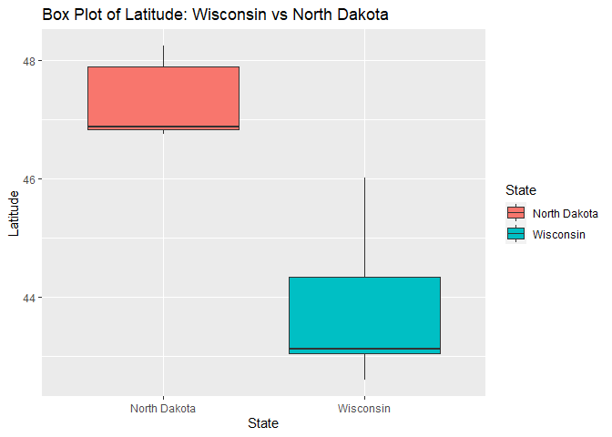

ST 558 Project 2
================
Matthew Sookoo and Rachel Hardy
2022-10-10

-   <a href="#introduction" id="toc-introduction">Introduction</a>
-   <a href="#required-packages" id="toc-required-packages">Required
    packages</a>
-   <a href="#writing-the-functions" id="toc-writing-the-functions">Writing
    the Functions</a>
    -   <a href="#function-number-one-listbreweries"
        id="toc-function-number-one-listbreweries">Function Number One:
        listBreweries()</a>
    -   <a href="#function-number-two-listbystate"
        id="toc-function-number-two-listbystate">Function Number Two:
        listByState()</a>
    -   <a href="#function-number-three-listbycity"
        id="toc-function-number-three-listbycity">Function Number Three:
        listByCity()</a>
    -   <a href="#function-number-four-listbydistance"
        id="toc-function-number-four-listbydistance">Function Number Four:
        listByDistance()</a>
    -   <a href="#function-number-five-listbytype"
        id="toc-function-number-five-listbytype">Function Number Five:
        listByType()</a>
    -   <a href="#function-number-six-listbysearch"
        id="toc-function-number-six-listbysearch">Function Number Six:
        listBySearch()</a>
-   <a href="#data-retreival-and-exploratory-analysis"
    id="toc-data-retreival-and-exploratory-analysis">Data Retreival and
    Exploratory Analysis</a>
    -   <a href="#data-retreival-and-modification-examples"
        id="toc-data-retreival-and-modification-examples">Data Retreival and
        Modification Examples</a>
        -   <a href="#brewpubs-and-bars-wisconsin-vs-north-dakota"
            id="toc-brewpubs-and-bars-wisconsin-vs-north-dakota">Brewpubs and Bars:
            Wisconsin vs North Dakota</a>
        -   <a href="#exploring-distance-madison-wisconsin"
            id="toc-exploring-distance-madison-wisconsin">Exploring Distance:
            Madison, Wisconsin</a>
    -   <a href="#numerical-summary-examples"
        id="toc-numerical-summary-examples">Numerical Summary Examples</a>
        -   <a href="#summary-of-latitude-and-longitude-wisconsin-vs-north-dakota"
            id="toc-summary-of-latitude-and-longitude-wisconsin-vs-north-dakota">Summary
            of Latitude and Longitude: Wisconsin vs North Dakota</a>
        -   <a href="#summary-of-latitude-and-longitude-san-diego-california"
            id="toc-summary-of-latitude-and-longitude-san-diego-california">Summary
            of Latitude and Longitude: San Diego, California</a>
        -   <a
            href="#summary-of-latitude-and-longitude-across-brewery-type-san-diego-california"
            id="toc-summary-of-latitude-and-longitude-across-brewery-type-san-diego-california">Summary
            of Latitude and Longitude Across Brewery Type: San Diego, California</a>
    -   <a href="#contingency-tables" id="toc-contingency-tables">Contingency
        Tables</a>
        -   <a href="#brewery-types-wisconsin-vs-north-dakota"
            id="toc-brewery-types-wisconsin-vs-north-dakota">Brewery Types:
            Wisconsin vs North Dakota</a>
        -   <a href="#brewery-types-50-random-breweries"
            id="toc-brewery-types-50-random-breweries">Brewery Types: 50 Random
            Breweries</a>
    -   <a href="#plots" id="toc-plots">Plots</a>
        -   <a href="#histograms-of-latitude-50-random-breweries"
            id="toc-histograms-of-latitude-50-random-breweries">Histograms of
            Latitude: 50 Random Breweries</a>
        -   <a href="#bar-plots-of-brewery-type-wisconsin-vs-north-dakota"
            id="toc-bar-plots-of-brewery-type-wisconsin-vs-north-dakota">Bar Plots
            of Brewery Type: Wisconsin vs North Dakota</a>
        -   <a href="#scatter-plot-of-longitude-vs-latitude-50-random-breweries"
            id="toc-scatter-plot-of-longitude-vs-latitude-50-random-breweries">Scatter
            Plot of Longitude vs Latitude: 50 Random Breweries</a>
        -   <a href="#box-plots-wisconsin-vs-north-dakota"
            id="toc-box-plots-wisconsin-vs-north-dakota">Box Plots: Wisconsin vs
            North Dakota</a>

# Introduction

Our goal with this project is to create a vignette about contacting an
API using functions we’ve created to query, parse, and return
well-structured data. We’ll then use our functions to obtain data from
the API and do some exploratory data analysis!

# Required packages

To use the functions for interacting with the API, the following
packages are used:

-   `tidyverse`: Tons of useful features for data manipulation and
    visualization!
-   `jsonlite`: Used for API interaction.
-   `httr`: Used to make http requests in R language as it provides a
    wrapper for the curl package.
-   `knitr`: Used for displaying tables in a markdown-friendly way.

# Writing the Functions

In this section we will write the functions for data retrieval. These
functions will allow the user to customize their query to return
specific data. We will be using an API that is focused on breweries.
Each function will return a data frame with variables such as brewery
ID, name, type, address (street, city, and state variables), postal
code, country, longitude, latitude, phone number, and website URL to
name a few. Each function will have a brief description.

## Function Number One: listBreweries()

The first function is a function that will return a list of breweries of
user-specified length. Default length is 20 and maximum length is 50.

``` r
listBreweries <- function(length = 20) {
  
  #Create the full URL that will be used to retrieve the data.
  baseURL <- "https://api.openbrewerydb.org/"
  endpoint <- "breweries?per_page="
  fullURL = paste0(baseURL, endpoint, length)
  
  #Get the API output.
  outputAPI <- GET(fullURL)
  
  #Parse the API output to get a data frame.
  finalAPI <- fromJSON(rawToChar(outputAPI$content))
  
  #Make sure latitude and longitude are numeric.
  finalAPI$longitude <- as.numeric(finalAPI$longitude)
  finalAPI$latitude <- as.numeric(finalAPI$latitude)
  
  #Return the final data frame.
  return(as_tibble(finalAPI))
}
```

## Function Number Two: listByState()

The second function is a function that will return a list of breweries
of user-specified length and state. Default length is 20 and default
state is North Carolina.

``` r
listByState <- function(state = "North Carolina", length = 20) {
  
  #Make sure state is all lowercase with underscores instead of spaces.
  state <- tolower(state)
  state <- sub(" ", "_", state)
  
  #Create the full URL that will be used to retrieve the data.
  baseURL <- "https://api.openbrewerydb.org/"
  endpoint1 <- "breweries?by_state="
  endpoint2 <- "&per_page="
  fullURL = paste0(baseURL, endpoint1, state, endpoint2, length)
  
  #Get the API output.
  outputAPI <- GET(fullURL)
  
  #Parse the API output to get a data frame.
  finalAPI <- fromJSON(rawToChar(outputAPI$content))
  
  #Make sure latitude and longitude are numeric.
  finalAPI$longitude <- as.numeric(finalAPI$longitude)
  finalAPI$latitude <- as.numeric(finalAPI$latitude)
  
  #Return the final data frame.
  return(as_tibble(finalAPI))
}
```

## Function Number Three: listByCity()

The third function is a function that will return a list of breweries of
user-specified length and city. Default length is 20 and default city is
San Diego, California.

``` r
listByCity <- function(city = "San Diego", length = 20) {
  
  #Make sure city is all lowercase with underscores instead of spaces.
  city <- tolower(city)
  city <- sub(" ", "_", city)
  
  #Create the full URL that will be used to retrieve the data.
  baseURL <- "https://api.openbrewerydb.org/"
  endpoint1 <- "breweries?by_city="
  endpoint2 <- "&per_page="
  fullURL = paste0(baseURL, endpoint1, city, endpoint2, length)
  
  #Get the API output.
  outputAPI <- GET(fullURL)
  
  #Parse the API output to get a data frame.
  finalAPI <- fromJSON(rawToChar(outputAPI$content))
  
  #Make sure latitude and longitude are numeric.
  finalAPI$longitude <- as.numeric(finalAPI$longitude)
  finalAPI$latitude <- as.numeric(finalAPI$latitude)
  
  #Return the final data frame.
  return(as_tibble(finalAPI))
}
```

## Function Number Four: listByDistance()

The fourth function is a function that will return a list of breweries
of user-specified length and sort the results by distance from a
user-specified origin point (latitude, longitude). Default length is 20
and default origin point is Raleigh, North Carolina (35.7796, -78.6382).

``` r
listByDistance <- function(lat = 35.7796, long = -78.6382, length = 20) {
  
  #Create the full URL that will be used to retrieve the data.
  baseURL <- "https://api.openbrewerydb.org/"
  endpoint1 <- "breweries?by_dist="
  endpoint2 <- "&per_page="
  fullURL = paste0(baseURL, endpoint1, lat, ",", long, endpoint2, length)
  
  #Get the API output.
  outputAPI <- GET(fullURL)
  
  #Parse the API output to get a data frame.
  finalAPI <- fromJSON(rawToChar(outputAPI$content))
  
  #Make sure latitude and longitude are numeric.
  finalAPI$longitude <- as.numeric(finalAPI$longitude)
  finalAPI$latitude <- as.numeric(finalAPI$latitude)
  
  #Return the final data frame.
  return(as_tibble(finalAPI))
}
```

## Function Number Five: listByType()

The fifth function is a function that will return a list of breweries of
user-specified length and type. Default length is 20 and default type is
micro.

The different types of breweries are listed below:

-   `micro`: Most craft breweries. For example, Samuel Adams is still
    considered a micro brewery.
-   `nano`: An extremely small brewery which typically only distributes
    locally.
-   `regional`: A regional location of an expanded brewery. Ex. Sierra
    Nevada’s Asheville, NC location.
-   `brewpub`: A beer-focused restaurant or restaurant/bar with a
    brewery on-premise.
-   `large`: A very large brewery. Likely not for visitors. Ex.
    Miller-Coors. (deprecated)
-   `planning`: A brewery in planning or not yet opened to the public.
-   `bar`: A bar. No brewery equipment on premise. (deprecated)
-   `contract`: A brewery that uses another brewery’s equipment.
-   `proprietor`: Similar to contract brewing but refers more to a
    brewery incubator.
-   `closed`: A location which has been closed.

``` r
listByType <- function(type = "micro", length = 20) {
  
  #Make sure type is all lowercase.
  type <- tolower(type)
  
  #Create the full URL that will be used to retrieve the data.
  baseURL <- "https://api.openbrewerydb.org/"
  endpoint1 <- "breweries?by_type="
  endpoint2 <- "&per_page="
  fullURL = paste0(baseURL, endpoint1, type, endpoint2, length)
  
  #Get the API output.
  outputAPI <- GET(fullURL)
  
  #Parse the API output to get a data frame.
  finalAPI <- fromJSON(rawToChar(outputAPI$content))
  
  #Make sure latitude and longitude are numeric.
  finalAPI$longitude <- as.numeric(finalAPI$longitude)
  finalAPI$latitude <- as.numeric(finalAPI$latitude)
  
  #Return the final data frame.
  return(as_tibble(finalAPI))
}
```

## Function Number Six: listBySearch()

The sixth function is a function that will return a list of breweries of
user-specified length based on a search term. Default length is 20 and
the user *must* specify a search term.

``` r
listBySearch <- function(search, length = 20) {
  
  #Make sure the search term is all lowercase with underscores instead of spaces.
  search <- tolower(search)
  search <- sub(" ", "_", search)
  
  #Create the full URL that will be used to retrieve the data.
  baseURL <- "https://api.openbrewerydb.org/"
  endpoint1 <- "breweries/search?query="
  endpoint2 <- "&per_page="
  fullURL = paste0(baseURL, endpoint1, search, endpoint2, length)
  
  #Get the API output.
  outputAPI <- GET(fullURL)
  
  #Parse the API output to get a data frame.
  finalAPI <- fromJSON(rawToChar(outputAPI$content))
  
  #Make sure latitude and longitude are numeric.
  finalAPI$longitude <- as.numeric(finalAPI$longitude)
  finalAPI$latitude <- as.numeric(finalAPI$latitude)
  
  #Return the final data frame.
  return(as_tibble(finalAPI))
}
```

# Data Retreival and Exploratory Analysis

In this section we will use the functions from the previous section to
extract our data and then we will analyze it using the `tidyverse`
package!

## Data Retreival and Modification Examples

### Brewpubs and Bars: Wisconsin vs North Dakota

We maybe interested in the percentage of brewpubs (a beer-focused
restaurant or restaurant/bar with a brewery on-premise) or bars (no
brewery equipment on premise) in Wisconsin and North Dakota as these two
states were found to be the two states that consumed the most alcohol.
click
[here](https://www.thecentersquare.com/wisconsin/this-is-where-wisconsin-ranks-among-the-drunkest-states-in-america/article_3ccd11a4-c261-563b-919a-e02a0254b6dd.html)
for more information.

Below, we create a new helper variable “brewpub_or_bar_1\_0” to display
1 if brewery type is either “brewpub or”bar” and 0 otherwise. We then
group the observations by state to find the percent of breweries in each
state that are either a brewpub or a bar.

As seen in the tibble below, 38.0% of Wisconsin breweries are either a
brewpub or a bar, while only 34.6% of North Dakota breweries are either
a brewpub or a bar.

Note that this does not include all possible breweries, as our API only
allows us to access 50 observations for each function called.

``` r
wisconsin <- listByState("Wisconsin", 50)
ndakota <- listByState("North Dakota", 50)

#Create the combined tibble.
combined_tibble <- rbind(wisconsin, ndakota)%>%
  mutate(brewpub_or_bar_1_0 = if_else((brewery_type == "brewpub" | brewery_type == "bar"), 1, 0)) %>%
  group_by(state) %>%
  mutate(percent_brewpub_bar = mean(brewpub_or_bar_1_0)*100) %>% 
  select(brewpub_or_bar_1_0, percent_brewpub_bar, everything())

#Print the combined tibble.
combined_tibble
```

    ## # A tibble: 76 × 19
    ##    brewpub_or_…¹ perce…² id    name  brewe…³ street addre…⁴ addre…⁵ city  state count…⁶ posta…⁷ country longi…⁸ latit…⁹ phone websi…˟ updat…˟
    ##            <dbl>   <dbl> <chr> <chr> <chr>   <chr>  <lgl>   <lgl>   <chr> <chr> <lgl>   <chr>   <chr>     <dbl>   <dbl> <chr> <chr>   <chr>  
    ##  1             0      38 1840… 1840… micro   342 E… NA      NA      Milw… Wisc… NA      53207-… United…   -87.9    43.0 4142… http:/… 2022-0…
    ##  2             0      38 3-sh… 3 Sh… micro   1837 … NA      NA      Sheb… Wisc… NA      53083-… United…   -87.7    43.8 9209… http:/… 2022-0…
    ##  3             0      38 608-… 608 … planni… <NA>   NA      NA      La C… Wisc… NA      54603   United…    NA      NA   <NA>  http:/… 2022-0…
    ##  4             1      38 841-… 841 … brewpub 841 E… NA      NA      Whit… Wisc… NA      53190-… United…   -88.7    42.8 2624… <NA>    2022-0…
    ##  5             1      38 8th-… 8th … brewpub 1132 … NA      NA      Sheb… Wisc… NA      53081-… United…   -87.7    43.8 9202… http:/… 2022-0…
    ##  6             0      38 agon… Agon… planni… <NA>   NA      NA      Rice… Wisc… NA      54868-… United…    NA      NA   7153… http:/… 2022-0…
    ##  7             0      38 ahna… Ahna… micro   N9153… NA      NA      Algo… Wisc… NA      54201-… United…    NA      NA   9202… http:/… 2022-0…
    ##  8             0      38 ale-… Ale … region… 2002 … NA      NA      Madi… Wisc… NA      53704-… United…   -89.4    43.1 6086… http:/… 2022-0…
    ##  9             1      38 alt-… ALT … brewpub 1808 … NA      NA      Madi… Wisc… NA      53704-… United…   -89.3    43.1 6083… http:/… 2022-0…
    ## 10             1      38 angr… Angr… brewpub 10440… NA      NA      Hayw… Wisc… NA      54843-… United…   -91.5    46.0 7159… http:/… 2022-0…
    ## # … with 66 more rows, 1 more variable: created_at <chr>, and abbreviated variable names ¹​brewpub_or_bar_1_0, ²​percent_brewpub_bar,
    ## #   ³​brewery_type, ⁴​address_2, ⁵​address_3, ⁶​county_province, ⁷​postal_code, ⁸​longitude, ⁹​latitude, ˟​website_url, ˟​updated_at

### Exploring Distance: Madison, Wisconsin

Since Wisconsin beat North Dakota in the comparison above, let’s see how
many breweries are close to the capital of the state: Madison,
Wisconsin. The latitude and longitude of Madison, Wisconsin is 43.0722
and -89.4008, respectively. The 50 breweries closest to Madison,
Wisconsin can be seen in the tibble below.

``` r
madison <- listByDistance(lat = 43.0722, long = -89.4008, length = 50)

#Print the tibble.
madison
```

    ## # A tibble: 50 × 17
    ##    id                  name  brewe…¹ street addre…² addre…³ city  state count…⁴ posta…⁵ country longi…⁶ latit…⁷ phone websi…⁸ updat…⁹ creat…˟
    ##    <chr>               <chr> <chr>   <chr>  <lgl>   <lgl>   <chr> <chr> <lgl>   <chr>   <chr>     <dbl>   <dbl> <chr> <chr>   <chr>   <chr>  
    ##  1 luckys-1313-brewpu… Luck… brewpub 1313 … NA      NA      Madi… Wisc… NA      53715-… United…   -89.4    43.1 6082… http:/… 2022-0… 2022-0…
    ##  2 rockhound-brewing-… Rock… brewpub 444 S… NA      NA      Madi… Wisc… NA      53715-… United…   -89.4    43.1 6082… http:/… 2022-0… 2022-0…
    ##  3 funk-factory-geuze… Funk… micro   1602 … NA      NA      Madi… Wisc… NA      53715-… United…   -89.4    43.1 <NA>  http:/… 2022-0… 2022-0…
    ##  4 working-draft-beer… Work… micro   1129 … NA      NA      Madi… Wisc… NA      53703-… United…   -89.4    43.1 <NA>  http:/… 2022-0… 2022-0…
    ##  5 great-dane-pub-and… Grea… brewpub 357 P… NA      NA      Madi… Wisc… NA      53705-… United…   -89.5    43.1 6086… http:/… 2022-0… 2022-0…
    ##  6 one-barrel-brewing… One … micro   2001 … NA      NA      Madi… Wisc… NA      53704-… United…   -89.4    43.1 6086… http:/… 2022-0… 2022-0…
    ##  7 next-door-brewing-… Next… brewpub 2439 … NA      NA      Madi… Wisc… NA      53704-… United…   -89.3    43.1 6087… http:/… 2022-0… 2022-0…
    ##  8 vintage-brewing-co… Vint… brewpub 674 S… NA      NA      Madi… Wisc… NA      53711-… United…   -89.5    43.1 6082… http:/… 2022-0… 2022-0…
    ##  9 great-dane-pub-and… Grea… brewpub 2980 … NA      NA      Fitc… Wisc… NA      53711-… United…   -89.4    43.0 6084… http:/… 2022-0… 2022-0…
    ## 10 ale-asylum-madison  Ale … region… 2002 … NA      NA      Madi… Wisc… NA      53704-… United…   -89.4    43.1 6086… http:/… 2022-0… 2022-0…
    ## # … with 40 more rows, and abbreviated variable names ¹​brewery_type, ²​address_2, ³​address_3, ⁴​county_province, ⁵​postal_code, ⁶​longitude,
    ## #   ⁷​latitude, ⁸​website_url, ⁹​updated_at, ˟​created_at

From the tibble above, we can create a modified tibble showing us which
breweries have a distance away from the origin point of both 0.05
longitude *AND* 0.05 latitude. If the “lat_and_long” variable equals 1,
this is true, and if it equals 0, this is false.

As seen in the modified tibble below, of the 50 breweries closest to
Madison, Wisconsin, only 6 are both more than 0.05 longitude and 0.05
latitude away from the origin point.

``` r
#Create the modified tibble.
madison_modified <- madison %>% 
  mutate(lat_and_long = if_else((longitude > -89.4508 & latitude > 43.1222), 1, 0)) %>%
  select(lat_and_long, everything()) %>%
  filter(lat_and_long == 1)

#Print the modified tibble.
madison_modified
```

    ## # A tibble: 6 × 18
    ##   lat_and_long id      name  brewe…¹ street addre…² addre…³ city  state count…⁴ posta…⁵ country longi…⁶ latit…⁷ phone websi…⁸ updat…⁹ creat…˟
    ##          <dbl> <chr>   <chr> <chr>   <chr>  <lgl>   <lgl>   <chr> <chr> <lgl>   <chr>   <chr>     <dbl>   <dbl> <chr> <chr>   <chr>   <chr>  
    ## 1            1 alt-br… ALT … brewpub 1808 … NA      NA      Madi… Wisc… NA      53704-… United…   -89.3    43.1 6083… http:/… 2022-0… 2022-0…
    ## 2            1 karben… Karb… micro   3698 … NA      NA      Madi… Wisc… NA      53704-… United…   -89.3    43.1 6082… http:/… 2022-0… 2022-0…
    ## 3            1 flix-b… Flix… brewpub 85 Ea… NA      NA      Madi… Wisc… NA      53704   United…   -89.3    43.1 5122… <NA>    2022-0… 2022-0…
    ## 4            1 octopi… Octo… micro   1131 … NA      NA      Waun… Wisc… NA      53597-… United…   -89.4    43.2 6086… http:/… 2022-0… 2022-0…
    ## 5            1 cercis… Cerc… micro   106 N… NA      NA      Colu… Wisc… NA      53925-  United…   -89.0    43.3 9203… <NA>    2022-0… 2022-0…
    ## 6            1 ooga-b… Ooga… brewpub 301 S… NA      NA      Beav… Wisc… NA      53916   United…   -88.8    43.5 9203… https:… 2022-0… 2022-0…
    ## # … with abbreviated variable names ¹​brewery_type, ²​address_2, ³​address_3, ⁴​county_province, ⁵​postal_code, ⁶​longitude, ⁷​latitude,
    ## #   ⁸​website_url, ⁹​updated_at, ˟​created_at

## Numerical Summary Examples

### Summary of Latitude and Longitude: Wisconsin vs North Dakota

Next we can create some numerical summaries for the mean and standard
deviations of the longitude and latitude variables across our two states
of interest: Wisconsin and North Dakota. It should be noted that the
“combine_tibble” object is already grouped by our state variable and we
remove the missing values (if there are any).

``` r
combined_tibble%>%filter(longitude != "Na", latitude != "Na")%>% 
  summarize(mean(longitude), mean(latitude), sd(longitude), sd(latitude))
```

    ## # A tibble: 2 × 5
    ##   state        `mean(longitude)` `mean(latitude)` `sd(longitude)` `sd(latitude)`
    ##   <chr>                    <dbl>            <dbl>           <dbl>          <dbl>
    ## 1 North Dakota             -99.3             47.2            2.39          0.554
    ## 2 Wisconsin                -89.1             43.7            1.33          0.853

### Summary of Latitude and Longitude: San Diego, California

The latitude and longitude of San Diego, California is 32.7157 and
-117.1611, respectively. We can create a tibble of breweries in San
Diego and find some summary statistics for the latitude and longitude
variables. Mathematically speaking, these numbers may not make a lot of
sense, this is just for the sake of showing the process!

``` r
san_diego <- listByCity(city = "San Diego", length = 50)

#Print the tibble.
san_diego
```

    ## # A tibble: 50 × 17
    ##    id                  name  brewe…¹ street addre…² addre…³ city  state count…⁴ posta…⁵ country longi…⁶ latit…⁷ phone websi…⁸ updat…⁹ creat…˟
    ##    <chr>               <chr> <chr>   <chr>  <lgl>   <lgl>   <chr> <chr> <lgl>   <chr>   <chr>     <dbl>   <dbl> <chr> <chr>   <chr>   <chr>  
    ##  1 10-barrel-brewing-… 10 B… large   1501 … NA      NA      San … Cali… NA      92101-… United…   -117.    32.7 6195… http:/… 2022-0… 2022-0…
    ##  2 2kids-brewing-comp… 2Kid… micro   8680 … NA      NA      San … Cali… NA      92126-… United…   -117.    32.9 8584… http:/… 2022-0… 2022-0…
    ##  3 32-north-brewing-c… 32 N… closed  8655 … NA      NA      San … Cali… NA      92121-… United…   -117.    32.9 <NA>  <NA>    2022-0… 2022-0…
    ##  4 abnormal-beer-comp… Abno… micro   16990… NA      NA      San … Cali… NA      92127-… United…   -117.    33.0 8586… http:/… 2022-0… 2022-0…
    ##  5 acoustic-ales-brew… Acou… closed  1795 … NA      NA      San … Cali… NA      92110-… United…   -117.    32.7 6192… http:/… 2022-0… 2022-0…
    ##  6 alesmith-brewing-c… AleS… region… 9990 … NA      NA      San … Cali… NA      92126-… United…   -117.    32.9 8585… http:/… 2022-0… 2022-0…
    ##  7 align-brewing-co-s… Alig… micro   8680 … NA      NA      San … Cali… NA      92126-… United…   -117.    32.9 <NA>  http:/… 2022-0… 2022-0…
    ##  8 alpine-beer-compan… Alpi… brewpub 6550 … NA      NA      San … Cali… NA      92121-… United…   -117.    32.9 6194… http:/… 2022-0… 2022-0…
    ##  9 alta-brewing-compa… Alta… micro   1983 … NA      NA      San … Cali… NA      92113-… United…   -117.    32.7 6197… http:/… 2022-0… 2022-0…
    ## 10 amplified-ale-work… Ampl… brewpub 9030 … NA      NA      San … Cali… NA      92121-… United…   -117.    32.9 6503… https:… 2022-0… 2022-0…
    ## # … with 40 more rows, and abbreviated variable names ¹​brewery_type, ²​address_2, ³​address_3, ⁴​county_province, ⁵​postal_code, ⁶​longitude,
    ## #   ⁷​latitude, ⁸​website_url, ⁹​updated_at, ˟​created_at

Now, we will use the summarize() function to find some summary
statistics.

``` r
#Creating the summary for longitude.
long_summary <- san_diego %>% summarize(mean_long = mean(longitude), min_long = min(longitude), max_long = max(longitude))

#Print the summary.
long_summary
```

    ## # A tibble: 1 × 3
    ##   mean_long min_long max_long
    ##       <dbl>    <dbl>    <dbl>
    ## 1     -117.    -117.    -117.

``` r
#Creating the summary for latitude.
lat_summary <- san_diego %>% summarize(mean_lat = mean(latitude), min_lat = min(latitude), max_lat = max(latitude))

#Print the summary.
lat_summary
```

    ## # A tibble: 1 × 3
    ##   mean_lat min_lat max_lat
    ##      <dbl>   <dbl>   <dbl>
    ## 1     32.8    32.7    33.0

As seen above in our list of 50 breweries in San Diego, the average
longitude is -117.1546 and the average latitude is 32.8133. The
respective minimum values are -117.2511 and 32.69822. The respective
maximum values are -117.0858 and 32.02391. As expected, latitude and
longitude do not vary much within a single city.

### Summary of Latitude and Longitude Across Brewery Type: San Diego, California

Next we can create some numerical summaries for the mean and standard
deviations of the longitude and latitude variables across the brewery
types in San Diego, California. Any missing values are removed as is
good practice.

``` r
san_diego %>% group_by(brewery_type) %>% filter(longitude != "Na", latitude != "Na") %>% 
  summarize(mean(longitude), mean(latitude), sd(longitude), sd(latitude))
```

    ## # A tibble: 7 × 5
    ##   brewery_type `mean(longitude)` `mean(latitude)` `sd(longitude)` `sd(latitude)`
    ##   <chr>                    <dbl>            <dbl>           <dbl>          <dbl>
    ## 1 brewpub                  -117.             32.8          0.0417         0.104 
    ## 2 closed                   -117.             32.8          0.0282         0.0561
    ## 3 contract                 -117.             32.9         NA             NA     
    ## 4 large                    -117.             32.8          0.0237         0.0856
    ## 5 micro                    -117.             32.8          0.0358         0.0803
    ## 6 planning                 -117.             32.7          0              0     
    ## 7 regional                 -117.             32.8          0.0605         0.0721

## Contingency Tables

### Brewery Types: Wisconsin vs North Dakota

We are interested in the two states with the highest consumption of
alcohol, namely Wisconsin and North Dakota. We show a contingency table
for brewery type in Wisconsin, another contingency table for brewery
type in North Dakota, and a two-way contingency table for brewery_type
for both states.

``` r
table(wisconsin$brewery_type)
```

    ## 
    ##  brewpub contract    micro planning regional 
    ##       19        3       19        5        4

``` r
table(ndakota$brewery_type)
```

    ## 
    ##     bar brewpub  closed   micro    nano 
    ##       1       8       3      12       2

``` r
table(combined_tibble$brewery_type, combined_tibble$state)
```

    ##           
    ##            North Dakota Wisconsin
    ##   bar                 1         0
    ##   brewpub             8        19
    ##   closed              3         0
    ##   contract            0         3
    ##   micro              12        19
    ##   nano                2         0
    ##   planning            0         5
    ##   regional            0         4

Lastly, we will show a two-way contingency table for brewery type by
state for each setting of the “brewpub_or_bar_1\_0” variable!

``` r
table(combined_tibble$brewery_type, combined_tibble$state, combined_tibble$brewpub_or_bar_1_0)
```

    ## , ,  = 0
    ## 
    ##           
    ##            North Dakota Wisconsin
    ##   bar                 0         0
    ##   brewpub             0         0
    ##   closed              3         0
    ##   contract            0         3
    ##   micro              12        19
    ##   nano                2         0
    ##   planning            0         5
    ##   regional            0         4
    ## 
    ## , ,  = 1
    ## 
    ##           
    ##            North Dakota Wisconsin
    ##   bar                 1         0
    ##   brewpub             8        19
    ##   closed              0         0
    ##   contract            0         0
    ##   micro               0         0
    ##   nano                0         0
    ##   planning            0         0
    ##   regional            0         0

### Brewery Types: 50 Random Breweries

For this example, we will pull a tibble of 50 breweries using the
listBreweries() function. We will first show a contingency table of
brewery types, and then a table of brewery types by country.

``` r
randomBreweries <- listBreweries(length = 50)

table(randomBreweries$brewery_type)
```

    ## 
    ##    brewpub     closed   contract      large      micro proprietor 
    ##          9          2          1          7         30          1

``` r
table(randomBreweries$brewery_type, randomBreweries$country)
```

    ##             
    ##              Ireland United States
    ##   brewpub          0             9
    ##   closed           0             2
    ##   contract         0             1
    ##   large            0             7
    ##   micro            1            29
    ##   proprietor       0             1

## Plots

### Histograms of Latitude: 50 Random Breweries

In the histogram below, we will take our tibble of random breweries
(length of 50), and create a histogram of the latitude variable. The
first histogram shown is a standard histogram with an x=axis
representing latitude and a y-axis representing count. The second
histogram shown is similar to the first, except we are now viewing
density instead of count.

Since we are using a tibble of random breweries for this example, we can
see that our latitude varies greatly, from as low as 30 to as high as
55. The second histogram with the density added just shows us a nice
smooth line in addition to the bars.

``` r
g1 <- ggplot(randomBreweries, aes(x = latitude))

g1 + geom_histogram(color = "black", fill = "#FF6666") + labs(title = "Histogram of Latitude") +
  labs(title = "Histogram of Latitude", x = "Latitude")
```

<!-- -->

``` r
g1 + geom_histogram(aes(y=..density..), colour="black", fill="white") + geom_density(alpha=.2, fill="#FF6666") + 
  labs(title = "Histogram of Latitude with Density", x = "Latitude")
```

<!-- -->

### Bar Plots of Brewery Type: Wisconsin vs North Dakota

For this example, we will use our combined_tibble object that has
brewery data from both Wisconsin and North Dakota. The first bar plot
will be simply showing us the count of the different brewery types in
the data, by grouping them we get a nice color scheme as opposed to one
single color.

``` r
g2 <- ggplot(combined_tibble, aes(x = brewery_type))

g2 + geom_bar(aes(fill = brewery_type)) + labs(title = "Brewery Types in Wisconsin and North Dakota", x = "Brewery Type") +
  scale_fill_discrete(name = "Brewery Type") +
  coord_flip()
```

<!-- -->

The second bar plot is very similar to the previous one, except here we
have grouped the brewery type data by our state variable!

``` r
g3 <- ggplot(combined_tibble, aes(x = brewery_type))

g3 + geom_bar(aes(fill = state), position = "dodge") + labs(title = "Brewery Types in Wisconsin and North Dakota", x = "Brewery Type") +
  scale_fill_discrete(name = "State") +
  coord_flip()
```

<!-- -->

### Scatter Plot of Longitude vs Latitude: 50 Random Breweries

We use the scatter plot to understand the relationship between two
quantitative variables. For this example, we are using our data of 50
random breweries and our two quantitative variables are longitude and
latitude. If the two variables were linearly related, we would see a
somewhat straight line. As seen below, there appears to be no
relationship between longitude and latitude, which makes sense!

``` r
g4 <- ggplot(randomBreweries, aes(y = longitude, x = latitude))

g4 + geom_point(aes(color = brewery_type)) + 
  labs(title = "Longitude vs Latitude: 50 Random Breweries", x = "Latitude", y = "Longitude") 
```

<!-- -->

### Box Plots: Wisconsin vs North Dakota

In this section, we will be creating box plots for our Wisconsin vs
North Dakota data.

For the first box plot we will look at the latitude variable for both
North Dakota and Wisconsin, separately. Of course, this graph isn’t very
meaningful mathematically, since the various latitudes within each
respective state will have a very small range, which can be seen in the
graph below.

``` r
g5 <- ggplot(combined_tibble, aes(x = state, y = latitude))

g5 + geom_boxplot(aes(fill = state)) + 
  labs(title = "Box Plot of Latitude: Wisconsin vs North Dakota", x = "State", y = "Latitude") +
  scale_fill_discrete(name = "State")
```

<!-- -->

The second graph isn’t extremely nice to look at, but it shows the
benefits of using facet_wrap() or facet_grid() to view separate graphs
for each level of a categorical variable, in this case that variable is
state. So in the left grid, we see latitude for each brewery type for
only North Dakota, and in the right grid we see latitude for each
brewery type for only Wisconsin.

``` r
g6 <- ggplot(combined_tibble, aes(x = brewery_type, y = latitude))

g6 + geom_boxplot(aes(fill = brewery_type)) + facet_wrap(~state, labeller = label_both) + 
  labs(title = "Box Plot of Latitude Grouped by Brewery Type: Wisconsin vs North Dakota", x = "Brewery Type", y = "Latitude") +
  scale_fill_discrete(name = "Brewery Type") +
  coord_flip()
```

<!-- -->
